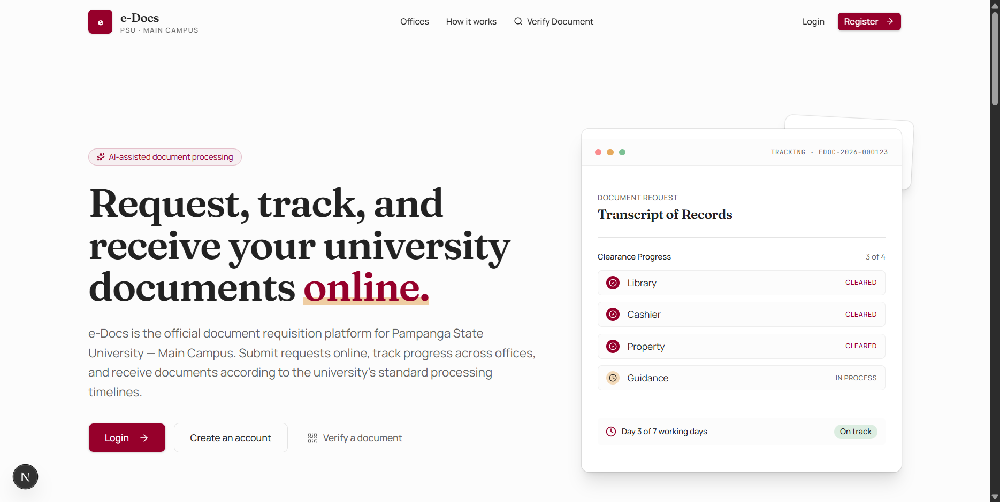
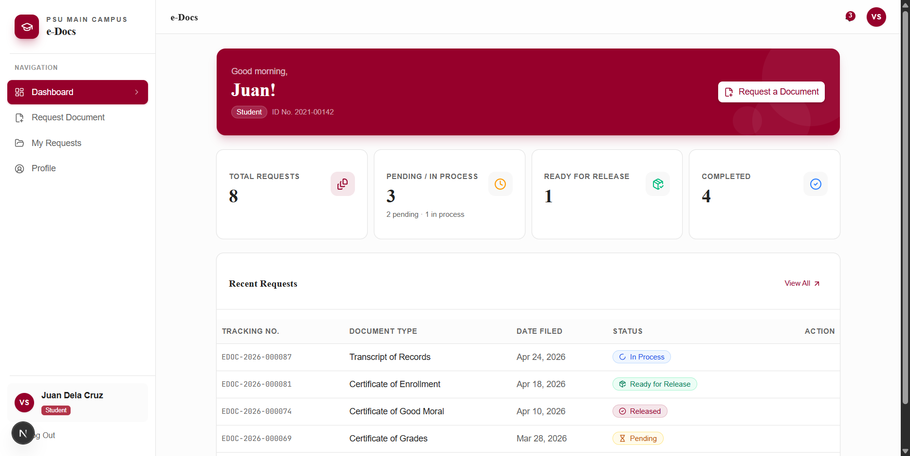

# e-Docs

AI-assisted online document requisition and management system for Pampanga State University – Main Campus. The platform supports front users (students, teaching faculty, non-teaching staff) and back users (office staff, office heads, and admins), with multi-office clearance workflows, document generation, and public verification.

## Documentation

- Project overview and requirements: [documentation/SRS.md](documentation/SRS.md)
- Architecture and routing map: [documentation/PROJECT_STRUCTURE.md](documentation/PROJECT_STRUCTURE.md)
- Conventions and standards: [documentation/CONVENTIONS.md](documentation/CONVENTIONS.md)

## System Syntax Diagram

See the system description and architecture details in these docs:

- [documentation/SRS.md](documentation/SRS.md)
- [documentation/PROJECT_STRUCTURE.md](documentation/PROJECT_STRUCTURE.md)

## Screenshots




## Getting Started

First, install dependencies and run the development server:

```bash
npm install
npm run dev
```

Open [http://localhost:3000](http://localhost:3000) in your browser.

## Tech Stack

- Next.js 14 (App Router)
- TypeScript
- Tailwind CSS
- Drizzle ORM
- Supabase Auth
